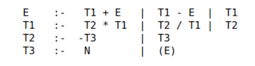

# Calculator for arithmetic expressions

In this repository, I considered a parsing algorithm using [recursive descent](https://en.wikipedia.org/wiki/Recursive_descent_parser) for a context-free [LL(1) grammar](https://en.wikipedia.org/wiki/LL_grammar#Simple_deterministic_languages) of the language of arithmetic expressions. I use [Top-Down parser](https://www.tutorialspoint.com/compiler_design/compiler_design_top_down_parser.htm) to create an expression tree.

### Based on [this idea](http://synset.com/logic/ru/intro/01_parser.html):

Grammar for arithmetic expressions:




## Getting Started

### Prerequisites

I use `Python3`, so first of all we need to install some python packages so that we can run tests and check types as well.

```bash
pip install -r requirements.txt
```

### Installing

Simply run:
```bash
pip install .
```

## Running the tests
Tests based on [Pytest](https://github.com/pytest-dev/pytest) fraimwork, to run all tests, enter:

```bash
pytest ./tests/
```

### Sample Tests

The tests in the section `tests / test_calculation` are needed to check the correctness of the calculation of arithmetic expressions. A few simple test cases:
```python
CASES = [CaseCalc("1", 1),
         CaseCalc("1 + 2", 3),
         CaseCalc("1 - 2", -1)]
```

### Style test

To check code style i use [flake8](https://gitlab.com/pycqa/flake8) and [mypy](https://github.com/python/mypy) for typings. Run the following command to start checking

* for `PEP8` code style:
```bash
flake ./
```

* for typing:
```bash
mypy ./
```

## License

This project is licensed under the [MIT](LICENSE.md)
